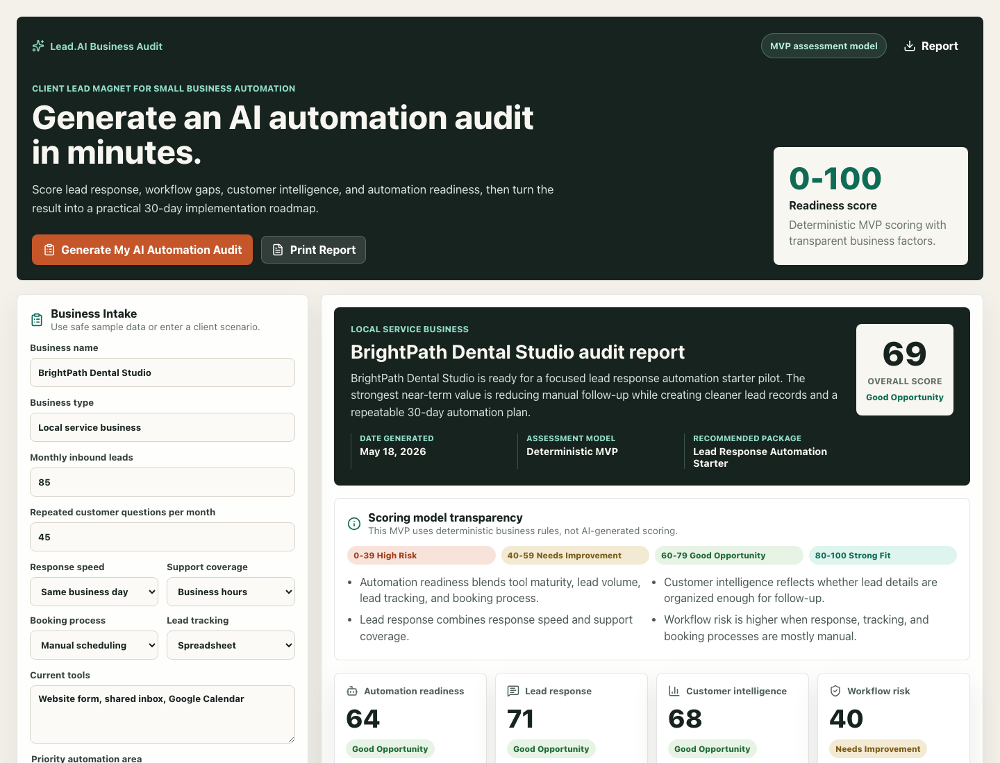
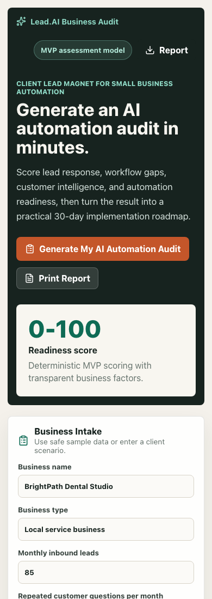

# Lead.AI Business Audit

A lead magnet and advisory tool that turns business pain points into an automation readiness score and 30-day roadmap.

## Product Status

MVP demo

This repository now includes a runnable client-side React MVP. It is suitable for public demo, product validation, and continued implementation. It should not be described as production-ready until backend persistence, authentication, tests, deployment hardening, and security controls are added.

## Live Demo

Public deployment: https://lead-ai-business-audit.vercel.app

Deployment notes:

- The Vercel production deployment is live.
- GitHub repository About URL is set.
- Automatic Vercel deploys from GitHub require completing the Vercel GitHub App connection for `Lead-AI-US` in the Vercel dashboard.

## Problem Solved

Small businesses do not know what to automate first or how much AI automation they need.

## Target Users

- Small business owners
- Local service businesses
- Consultants
- Agencies
- Startup founders

## Key Features

- Business intake form
- Automation readiness score
- Lead response score
- Workflow gap analysis
- Transparent score bands and scoring explanation
- Recommended automation package
- Top 3 automation priorities
- 30-day roadmap
- Print/save report output
- Implementation help CTA

## Tech Stack

- React
- TypeScript
- Vite
- Lucide React icons
- Deterministic client-side scoring logic
- FastAPI or serverless backend planned for future persistence and AI workflows

## Architecture Overview

The intended architecture separates product UI, backend workflows, AI orchestration, data storage, integrations, and operational controls.

Core layers:

- User experience layer for business users and administrators.
- API or service layer for validation, workflow execution, and integrations.
- AI layer for prompts, scoring, summaries, recommendations, or decision support.
- Data layer for leads, conversations, reports, scores, configuration, or audit records.
- Security layer for authentication, authorization, privacy, logging, and secret management.

See [Architecture](docs/ARCHITECTURE.md) for the detailed design direction.

## Setup Instructions

Install dependencies and start the local development server:

```bash
npm install
npm run dev
```

Run quality checks:

```bash
npm run lint
npm run build
```

Preview the production build:

```bash
npm run preview
```

## Environment Variables

Configuration is documented in [.env.example](.env.example). Use placeholder names only in public files. Never commit real `.env` files, API keys, access tokens, private credentials, customer exports, or private datasets.

The current MVP demo runs without required environment variables. Future backend, report storage, email, and AI provider integrations should use `.env.example` as the source of truth.

## Usage Flow

1. Business owner completes the audit intake form.
2. The system scores automation readiness, lead response, and workflow gaps.
3. The user receives a prioritized 30-day automation roadmap.
4. The report presents a clear next step or consultation CTA.

See [User Flow](docs/USER_FLOW.md) for more detail.

## Scoring Model

The current MVP uses deterministic business rules. It does not claim to generate scores with AI.

Score bands:

- `0-39`: High Risk / Low Automation Readiness
- `40-59`: Needs Improvement
- `60-79`: Good Opportunity
- `80-100`: Strong Automation Fit

The model considers lead volume, response speed, support coverage, booking process, lead tracking maturity, current tools, and repeated customer question volume. Scores are a planning aid for automation discovery, not a final operational decision.

## Demo Screenshots

### Desktop View



### Mobile View



## Deployment

Vercel:

```bash
npm install
npm run build
vercel
vercel --prod
```

Firebase Hosting, optional:

```bash
npm install
npm run build
firebase init hosting
firebase deploy
```

The current MVP does not require environment variables.

## Roadmap

See [Roadmap](docs/ROADMAP.md) and [MVP Plan](docs/MVP_PLAN.md).

Immediate next step: add backend persistence, report export storage, and a shareable client-facing demo link.

## Version 0.2 Roadmap: Report Storage + Lead Capture

- Save audit reports to Firebase Firestore.
- Collect business owner name, email, phone, and website.
- Generate unique report IDs.
- Add admin view for submitted audits.
- Add email notification placeholder.
- Add export to PDF.
- Add "Request Lead.AI Implementation" submission flow.

## Security Notes

- Do not commit secrets or private customer data.
- Validate user input before storage, scoring, AI processing, or external API calls.
- Avoid logging personally identifiable information.
- Add authentication and authorization before handling protected business data.

See [Security](docs/SECURITY.md).

## Responsible AI Notes

- Keep AI limitations visible to users and reviewers.
- Avoid unsupported claims about accuracy or reliability.
- Provide human review or handoff for sensitive, uncertain, or high-impact outcomes.
- Prefer explainable outputs for scores, recommendations, and risk signals.

## Related Lead.AI Products

- [Lead.AI Platform](https://github.com/Lead-AI-US/lead-ai-platform)
- [Lead.AI Business Audit](https://github.com/Lead-AI-US/lead-ai-business-audit)
- [Lead.AI WhatsApp Agent](https://github.com/Lead-AI-US/lead-ai-whatsapp-agent)
- [Lead.AI Website Chatbot](https://github.com/Lead-AI-US/lead-ai-website-chatbot)
- [Lead.AI Lead Scoring API](https://github.com/Lead-AI-US/lead-ai-lead-scoring-api)
- [Lead.AI Prompt Vault](https://github.com/Lead-AI-US/lead-ai-prompt-vault)
- [Lead.AI Firebase SaaS Starter](https://github.com/Lead-AI-US/lead-ai-firebase-saas-starter)
- [Lead.AI Fraud Shield](https://github.com/Lead-AI-US/lead-ai-fraud-shield)

## Author

Founded by Arun Kumar Gharami.  
Website: https://www.lead-ai.us  
GitHub: https://github.com/Arungharami

Contact: arun_w@proton.me

## License

See [LICENSE](LICENSE). A final license should be selected before accepting external contributions or publishing reusable code.
